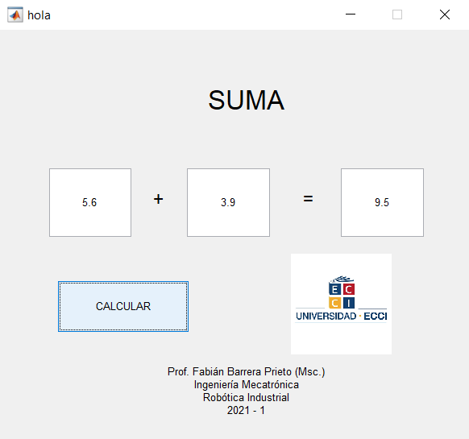
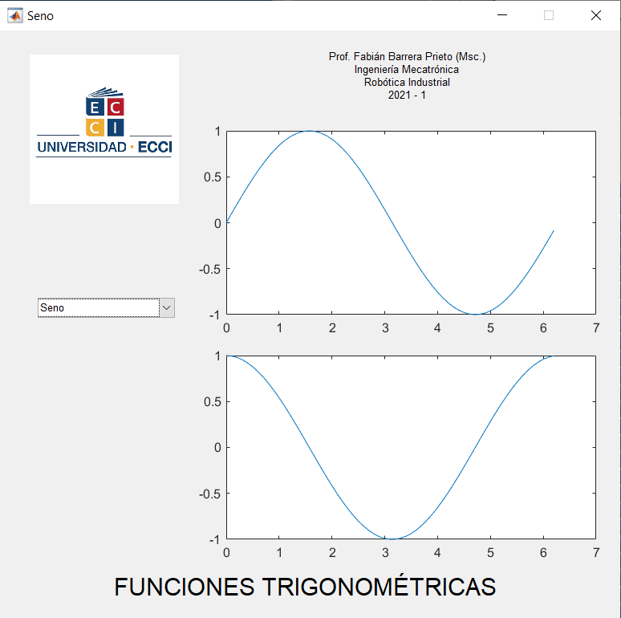

<h1>Aula 12</h1>

Esta clase consiste en aprender a crear interfaces gráficas (GUI) en Matlab

<h2>Interfaces gráficas (GUI)</h2>

Las interfaces gráficas permiten la interacción entre el humano y la máquina.

<h3>Ejercicio 1</h3>

Este ejercicio representa una suma aritmética de dos números, a través de objetos tipo <i>edit text</i> y <i>push button</i>.



```matlab
function varargout = hola(varargin)
% HOLA MATLAB code for hola.fig
%      HOLA, by itself, creates a new HOLA or raises the existing
%      singleton*.
%
%      H = HOLA returns the handle to a new HOLA or the handle to
%      the existing singleton*.
%
%      HOLA('CALLBACK',hObject,eventData,handles,...) calls the local
%      function named CALLBACK in HOLA.M with the given input arguments.
%
%      HOLA('Property','Value',...) creates a new HOLA or raises the
%      existing singleton*.  Starting from the left, property value pairs are
%      applied to the GUI before hola_OpeningFcn gets called.  An
%      unrecognized property name or invalid value makes property application
%      stop.  All inputs are passed to hola_OpeningFcn via varargin.
%
%      *See GUI Options on GUIDE's Tools menu.  Choose "GUI allows only one
%      instance to run (singleton)".
%
% See also: GUIDE, GUIDATA, GUIHANDLES

% Edit the above text to modify the response to help hola

% Last Modified by GUIDE v2.5 15-Feb-2021 20:31:45

% Begin initialization code - DO NOT EDIT
gui_Singleton = 1;
gui_State = struct('gui_Name',       mfilename, ...
                   'gui_Singleton',  gui_Singleton, ...
                   'gui_OpeningFcn', @hola_OpeningFcn, ...
                   'gui_OutputFcn',  @hola_OutputFcn, ...
                   'gui_LayoutFcn',  [] , ...
                   'gui_Callback',   []);
if nargin && ischar(varargin{1})
    gui_State.gui_Callback = str2func(varargin{1});
end

if nargout
    [varargout{1:nargout}] = gui_mainfcn(gui_State, varargin{:});
else
    gui_mainfcn(gui_State, varargin{:});
end
% End initialization code - DO NOT EDIT


% --- Executes just before hola is made visible.
function hola_OpeningFcn(hObject, eventdata, handles, varargin)
% This function has no output args, see OutputFcn.
% hObject    handle to figure
% eventdata  reserved - to be defined in a future version of MATLAB
% handles    structure with handles and user data (see GUIDATA)
% varargin   command line arguments to hola (see VARARGIN)

% Choose default command line output for hola
handles.output = hObject;

% Update handles structure
guidata(hObject, handles);

% UIWAIT makes hola wait for user response (see UIRESUME)
% uiwait(handles.figure1);
axes(handles.axes1)
matlabImage = imread('ECCI.png');
image(matlabImage)
axis off
axis image

% --- Outputs from this function are returned to the command line.
function varargout = hola_OutputFcn(hObject, eventdata, handles) 
% varargout  cell array for returning output args (see VARARGOUT);
% hObject    handle to figure
% eventdata  reserved - to be defined in a future version of MATLAB
% handles    structure with handles and user data (see GUIDATA)

% Get default command line output from handles structure
varargout{1} = handles.output;


% --- Executes during object creation, after setting all properties.
function text2_CreateFcn(hObject, eventdata, handles)
% hObject    handle to text2 (see GCBO)
% eventdata  reserved - to be defined in a future version of MATLAB
% handles    empty - handles not created until after all CreateFcns called


function edit1_Callback(hObject, eventdata, handles)
% hObject    handle to edit1 (see GCBO)
% eventdata  reserved - to be defined in a future version of MATLAB
% handles    structure with handles and user data (see GUIDATA)

% Hints: get(hObject,'String') returns contents of edit1 as text
%        str2double(get(hObject,'String')) returns contents of edit1 as a double


% --- Executes during object creation, after setting all properties.
function edit1_CreateFcn(hObject, eventdata, handles)
% hObject    handle to edit1 (see GCBO)
% eventdata  reserved - to be defined in a future version of MATLAB
% handles    empty - handles not created until after all CreateFcns called

% Hint: edit controls usually have a white background on Windows.
%       See ISPC and COMPUTER.
if ispc && isequal(get(hObject,'BackgroundColor'), get(0,'defaultUicontrolBackgroundColor'))
    set(hObject,'BackgroundColor','white');
end


function edit2_Callback(hObject, eventdata, handles)
% hObject    handle to edit2 (see GCBO)
% eventdata  reserved - to be defined in a future version of MATLAB
% handles    structure with handles and user data (see GUIDATA)

% Hints: get(hObject,'String') returns contents of edit2 as text
%        str2double(get(hObject,'String')) returns contents of edit2 as a double


% --- Executes during object creation, after setting all properties.
function edit2_CreateFcn(hObject, eventdata, handles)
% hObject    handle to edit2 (see GCBO)
% eventdata  reserved - to be defined in a future version of MATLAB
% handles    empty - handles not created until after all CreateFcns called

% Hint: edit controls usually have a white background on Windows.
%       See ISPC and COMPUTER.
if ispc && isequal(get(hObject,'BackgroundColor'), get(0,'defaultUicontrolBackgroundColor'))
    set(hObject,'BackgroundColor','white');
end


% --- Executes on button press in pushbutton1.
function pushbutton1_Callback(hObject, eventdata, handles)
% hObject    handle to pushbutton1 (see GCBO)
% eventdata  reserved - to be defined in a future version of MATLAB
% handles    structure with handles and user data (see GUIDATA)
num1 = str2num(get(handles.edit1,'string'));
num2 = str2num(get(handles.edit2,'string'));
res = num1 + num2;
set(handles.edit3,'string',res)

% --- Executes during object creation, after setting all properties.
function pushbutton1_CreateFcn(hObject, eventdata, handles)
% hObject    handle to pushbutton1 (see GCBO)
% eventdata  reserved - to be defined in a future version of MATLAB
% handles    empty - handles not created until after all CreateFcns called


function edit3_Callback(hObject, eventdata, handles)
% hObject    handle to edit3 (see GCBO)
% eventdata  reserved - to be defined in a future version of MATLAB
% handles    structure with handles and user data (see GUIDATA)

% Hints: get(hObject,'String') returns contents of edit3 as text
%        str2double(get(hObject,'String')) returns contents of edit3 as a double


% --- Executes during object creation, after setting all properties.
function edit3_CreateFcn(hObject, eventdata, handles)
% hObject    handle to edit3 (see GCBO)
% eventdata  reserved - to be defined in a future version of MATLAB
% handles    empty - handles not created until after all CreateFcns called

% Hint: edit controls usually have a white background on Windows.
%       See ISPC and COMPUTER.
if ispc && isequal(get(hObject,'BackgroundColor'), get(0,'defaultUicontrolBackgroundColor'))
    set(hObject,'BackgroundColor','white');
end

```

<h3>Ejercicio 2</h3>

Este ejercicio representa las gráficas de seno, coseno y tangente, a través de objetos tipo <i>pop up menu</i> y <i>axes</i>.



```matlab
function varargout = Seno(varargin)
% SENO MATLAB code for Seno.fig
%      SENO, by itself, creates a new SENO or raises the existing
%      singleton*.
%
%      H = SENO returns the handle to a new SENO or the handle to
%      the existing singleton*.
%
%      SENO('CALLBACK',hObject,eventData,handles,...) calls the local
%      function named CALLBACK in SENO.M with the given input arguments.
%
%      SENO('Property','Value',...) creates a new SENO or raises the
%      existing singleton*.  Starting from the left, property value pairs are
%      applied to the GUI before Seno_OpeningFcn gets called.  An
%      unrecognized property name or invalid value makes property application
%      stop.  All inputs are passed to Seno_OpeningFcn via varargin.
%
%      *See GUI Options on GUIDE's Tools menu.  Choose "GUI allows only one
%      instance to run (singleton)".
%
% See also: GUIDE, GUIDATA, GUIHANDLES

% Edit the above text to modify the response to help Seno

% Last Modified by GUIDE v2.5 15-Feb-2021 21:18:52

% Begin initialization code - DO NOT EDIT
gui_Singleton = 1;
gui_State = struct('gui_Name',       mfilename, ...
                   'gui_Singleton',  gui_Singleton, ...
                   'gui_OpeningFcn', @Seno_OpeningFcn, ...
                   'gui_OutputFcn',  @Seno_OutputFcn, ...
                   'gui_LayoutFcn',  [] , ...
                   'gui_Callback',   []);
if nargin && ischar(varargin{1})
    gui_State.gui_Callback = str2func(varargin{1});
end

if nargout
    [varargout{1:nargout}] = gui_mainfcn(gui_State, varargin{:});
else
    gui_mainfcn(gui_State, varargin{:});
end
% End initialization code - DO NOT EDIT


% --- Executes just before Seno is made visible.
function Seno_OpeningFcn(hObject, eventdata, handles, varargin)
% This function has no output args, see OutputFcn.
% hObject    handle to figure
% eventdata  reserved - to be defined in a future version of MATLAB
% handles    structure with handles and user data (see GUIDATA)
% varargin   command line arguments to Seno (see VARARGIN)

% Choose default command line output for Seno
handles.output = hObject;

% Update handles structure
guidata(hObject, handles);

% UIWAIT makes Seno wait for user response (see UIRESUME)
% uiwait(handles.figure1);
axes(handles.axes3)
matlabImage = imread('ECCI.png');
image(matlabImage)
axis off
axis image

% --- Outputs from this function are returned to the command line.
function varargout = Seno_OutputFcn(hObject, eventdata, handles) 
% varargout  cell array for returning output args (see VARARGOUT);
% hObject    handle to figure
% eventdata  reserved - to be defined in a future version of MATLAB
% handles    structure with handles and user data (see GUIDATA)

% Get default command line output from handles structure
varargout{1} = handles.output;


% --- Executes on selection change in listbox1.
function listbox1_Callback(hObject, eventdata, handles)
% hObject    handle to listbox1 (see GCBO)
% eventdata  reserved - to be defined in a future version of MATLAB
% handles    structure with handles and user data (see GUIDATA)

% Hints: contents = cellstr(get(hObject,'String')) returns listbox1 contents as cell array
%        contents{get(hObject,'Value')} returns selected item from listbox1


% --- Executes during object creation, after setting all properties.
function listbox1_CreateFcn(hObject, eventdata, handles)
% hObject    handle to listbox1 (see GCBO)
% eventdata  reserved - to be defined in a future version of MATLAB
% handles    empty - handles not created until after all CreateFcns called

% Hint: listbox controls usually have a white background on Windows.
%       See ISPC and COMPUTER.
if ispc && isequal(get(hObject,'BackgroundColor'), get(0,'defaultUicontrolBackgroundColor'))
    set(hObject,'BackgroundColor','white');
end


% --- Executes on selection change in popupmenu1.
function popupmenu1_Callback(hObject, eventdata, handles)
% hObject    handle to popupmenu1 (see GCBO)
% eventdata  reserved - to be defined in a future version of MATLAB
% handles    structure with handles and user data (see GUIDATA)

% Hints: contents = cellstr(get(hObject,'String')) returns popupmenu1 contents as cell array
%        contents{get(hObject,'Value')} returns selected item from popupmenu1
t = 0:0.1:2*pi;
AllItems = get(handles.popupmenu1,'string');
SelectedIndex = get(handles.popupmenu1,'value');
SelectedItem = AllItems{SelectedIndex};
switch SelectedItem
    case 'Seno'
        plot(handles.axes1,t,sin(t));
    case 'Coseno'
        plot(handles.axes2,t,cos(t));
    otherwise
        plot(handles.axes1,t,tan(t));
        plot(handles.axes2,t,tan(t));
end

% --- Executes during object creation, after setting all properties.
function popupmenu1_CreateFcn(hObject, eventdata, handles)
% hObject    handle to popupmenu1 (see GCBO)
% eventdata  reserved - to be defined in a future version of MATLAB
% handles    empty - handles not created until after all CreateFcns called

% Hint: popupmenu controls usually have a white background on Windows.
%       See ISPC and COMPUTER.
if ispc && isequal(get(hObject,'BackgroundColor'), get(0,'defaultUicontrolBackgroundColor'))
    set(hObject,'BackgroundColor','white');
end


% --- Executes during object creation, after setting all properties.
function axes1_CreateFcn(hObject, eventdata, handles)
% hObject    handle to axes1 (see GCBO)
% eventdata  reserved - to be defined in a future version of MATLAB
% handles    empty - handles not created until after all CreateFcns called

% Hint: place code in OpeningFcn to populate axes1


% --- Executes during object creation, after setting all properties.
function axes2_CreateFcn(hObject, eventdata, handles)
% hObject    handle to axes2 (see GCBO)
% eventdata  reserved - to be defined in a future version of MATLAB
% handles    empty - handles not created until after all CreateFcns called

% Hint: place code in OpeningFcn to populate axes2

```