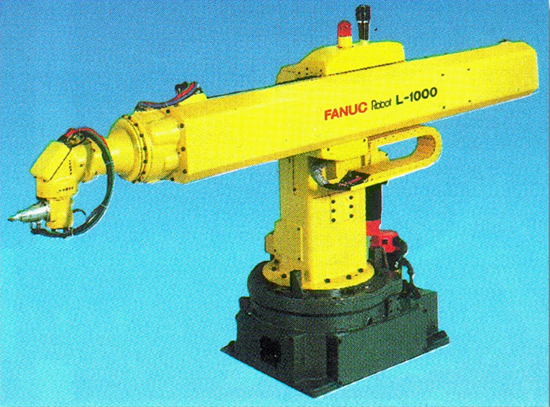
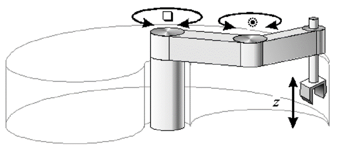

<h1>Aula 2</h1>

Esta clase consiste en comprender los conceptos básicos de la morfología de un robot manipulador, así mismo, se realizan los diagramas de los tipos de robots manipuladores más convencionales (cartesiano, SCARA, esférico, cilíndrico, antropomórfico o angular).

<h2>MORFOLOGÍA DEL ROBOT</h2>

<h3>Morfología</h3>

La morfología estudia la forma y la estructura de un ser vivo (biología), de las palabras (lingüística), de un robot (robótica), de la superficie terrestre (geomorfología), entre otros.

Fuente: https://academia-lab.com/wp-content/uploads/2022/07/328898040.webp

Fuente:https://i.pinimg.com/736x/4e/4c/90/4e4c90b475e65efb6f5204f0d0e9f613.jpg

Fuente: https://centrolitoralmaruca.files.wordpress.com/2020/04/morfologc3adalitoral.jpg

<h3>Morfología del robot manipulador</h3>

Fuente: https://cloud.educaplay.com/recursos/29/934138/imagen_1.gif

Fuente:https://4.bp.blogspot.com/-dXsCOLTrSLo/WW1ijATx2OI/AAAAAAAAATc/o_ehBryIKrgsHwWhM6JpBQqHZT6oYMVCwCEwYBhgL/s1600/201707172006331000.jpg

<h3>Estructura mecánica de un robot manipulador</h3>

<h3>Unidad de control de un robot manipulador</h3>

- Teach pendant

- Efector final o <i>Gripper</i>

<h3>Articulaciones</h3>

<h4>Transmisión de articulaciones</h4>

<h3>Tipos de robots</h3>

Fuente: https://charlesandrew.files.wordpress.com/2010/04/15.png

Fuente: https://www.kramirez.net/Robotica/Material/Presentaciones/CinematicaInversaRobot.pdf

<h4>Robot cartesiano</h4>

Es un robot PPP, el cual tiene tres movimientos lineales y perpendiculares entre sí, en los tres ejes cartesianos X, Y y Z. Este tipo de robot se emplea en trabajos de carga, desplazamiento y descarga de materiales, en aplicaciones de sellado, ensamblaje, manejo de máquinas-herramientas, y soldadura al arco.

Fuente: https://global.yamaha-motor.com/business/robot_es/xyx/img/lineup_002.jpg

Fuente: https://www.machinedesign.com/markets/robotics/article/21835000/whats-the-difference-between-industrial-robots

<h4>Robot cilíndrico</h4>

Es un robot RPP, que cuenta con una articulación rotacional y dos prismáticas. Son utilizados en operaciones de ensamblaje, manejo de máquinas-herramientas, soldaduras por puntos, y manejo, vaciado y moldeado de metales

Fuente: https://wobit.com.pl/en/produkt/10753/roboty-przemyslowe-tower/robot-tower-tr300/

Fuente: https://www.machinedesign.com/markets/robotics/article/21835000/whats-the-difference-between-industrial-robots

<h4>Robot esférico</h4>

Es un robot RRP, el cual tiene dos articulaciones rotacionales y una prismática; aplicado en máquinas-herramientas, soldaduras por puntos, vaciado de metales, frezado, soldadura a gas, y soldadura al arco.

Fuente: https://www.machinedesign.com/markets/robotics/article/21835000/whats-the-difference-between-industrial-robots

<h4>Robot SCARA</h4>

Es un robot RRP, que combina dos articulaciones rotacionales y una prismática. Se utilizan en trabajos de carga, desplazamiento y descarga de materiales, en aplicaciones de sellado, ensamblaje, y manejo de máquinas-herramientas.  

Fuente: https://mediaserver.goepson.com/ImConvServlet/imconv/b2d9a42135880e61254f20303fa56589d46315b0/1200Wx1200H?use=banner&hybrisId=B2C&assetDescr=t3_04_690x460

<h4>Robot antropomórfico o angular</h4>

Es un robot RRR, que cuenta con todas las articulaciones rotacionales. Estos robots tienen un gran espacio de trabajo y son muy populares, pero su control es mucho más complejo que el robot cartesiano, debido a su análisis dinámico. Se emplean en operaciones de ensamblaje, vaciado de metales, frezado, soldadura a gas, soldadura al arco, y pintura con spray.

Fuente: https://www.kellertechnology.com/wp-content/uploads/2016/10/Industrial-Robots-Main-Image.jpg

Fuente: https://mecademic.com/wp-content/uploads/2023/04/robot-workspace.png