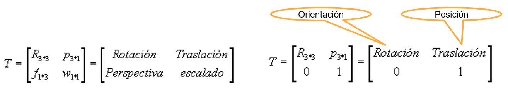
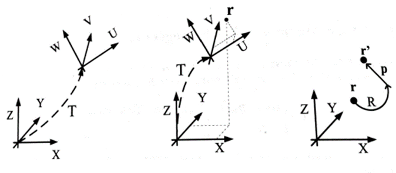
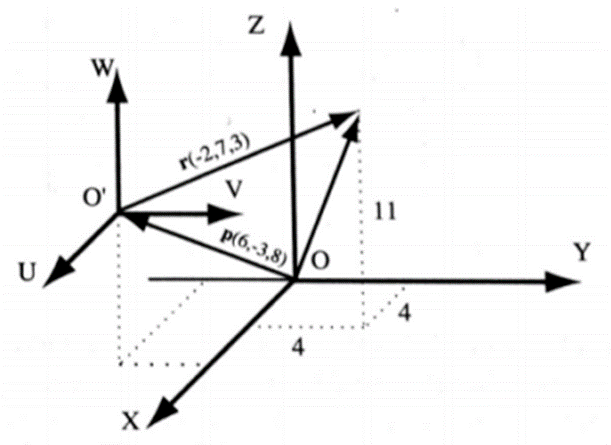
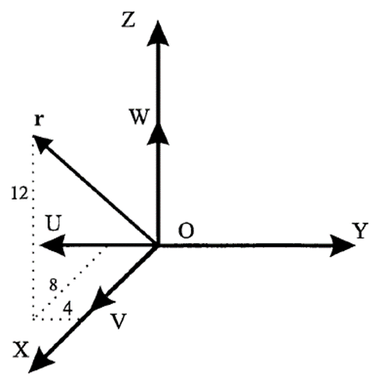
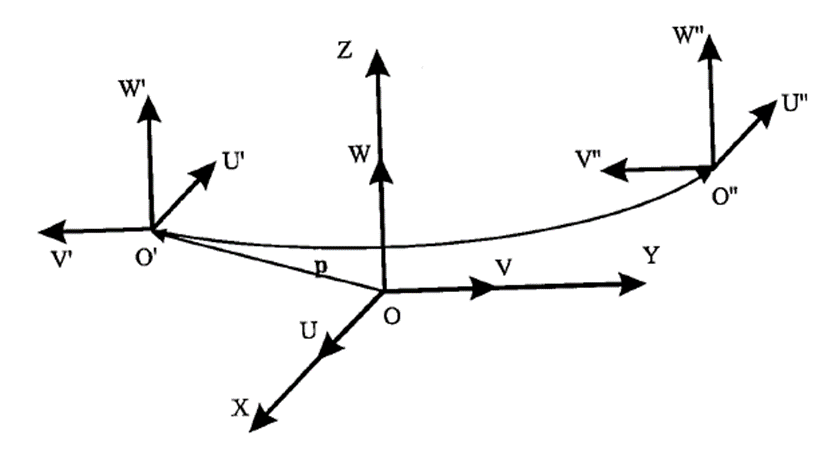
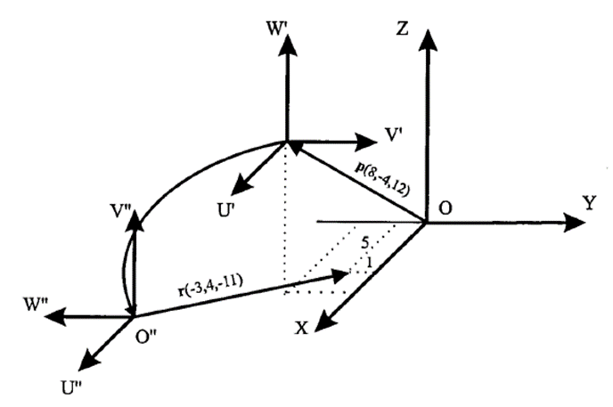
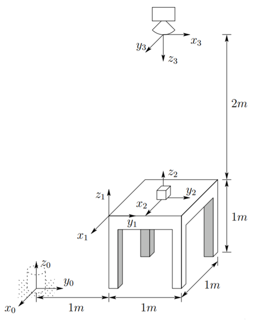

<h1>Aula 4</h1>

Esta clase consiste en relacionar la traslación y la rotación en la matriz de transformación homogénea (MTH).

<h2>Matriz de transformación homogénea (MTH)</h2>

Representa la transformación de la localización (orientación y posición) de un vector de coordenadas homogéneas de un sistema de coordenadas OUVW con respecto al sistema de referencia OXYZ.

Fuente: Barrientos, A., Peñín, L.F., Balaguer, C., y Aracil, R., 2007, Fundamentos de Robótica, 2nd edition, McGraw-Hill.

<h3>Justificaciones de la MTH</h3>

1. Representar la posición y orientación de un sistema girado y trasladado O’UVW con respecto a un sistema fijo de referencia OXYZ, que es lo mismo que representar una rotación y traslación realizada sobre un sistema de referencia.
2. Transformar un vector expresado en coordenadas con respecto a un sistema O’UVW, a su expresión en coordenadas del sistema de referencia OXYZ.
3. Rotar y trasladar un vector con respecto a un sistema de referencia fijo OXYZ.

Fuente: Barrientos, A., Peñín, L.F., Balaguer, C., y Aracil, R., 2007, Fundamentos de Robótica, 2nd edition, McGraw-Hill.

<h3>Traslación (MTH)</h3>

En la figura, el sistema O’UVW está trasladado de un vector 𝑝(6,−3,8) con respecto del sistema OXYZ. Calcular las coordenadas (𝑟_𝑥,𝑟_𝑦,𝑟_𝑧) del vector 𝑟, cuyas coordenadas con respecto al sistema O’UVW son 𝑟_𝑢𝑣𝑤 (−2,7,3)

Fuente: Barrientos, A., Peñín, L.F., Balaguer, C., y Aracil, R., 2007, Fundamentos de Robótica, 2nd edition, McGraw-Hill.

$$
\begin{bmatrix}
𝑟_𝑥\\ 
𝑟_𝑦\\ 
𝑟_𝑧\\ 
1
\end{bmatrix} = \begin{bmatrix}
1 & 0 & 0 & 𝑝_𝑥\\ 
0 & 1 & 0 & 𝑝_𝑦\\ 
0 & 0 & 0 & 𝑝_𝑧\\ 
0 & 0 & 0 & 1
\end{bmatrix} \cdot \begin{bmatrix}
𝑟_𝑢\\ 
𝑟_𝑣\\ 
𝑟_𝑤\\ 
1
\end{bmatrix} = \begin{bmatrix}
𝑟_𝑢+𝑝_𝑥\\ 
𝑟_𝑣+𝑝_𝑦\\ 
𝑟_𝑤+𝑝_𝑧\\ 
1
\end{bmatrix}
$$

$$
\begin{bmatrix}
𝑟_𝑥\\ 
𝑟_𝑦\\ 
𝑟_𝑧\\ 
1
\end{bmatrix} = \begin{bmatrix}
1 & 0 & 0 & 6\\ 
0 & 1 & 0 & -3\\ 
0 & 0 & 0 & 8\\ 
0 & 0 & 0 & 1
\end{bmatrix} \cdot \begin{bmatrix}
-2\\ 
7\\ 
3\\ 
1
\end{bmatrix} = \begin{bmatrix}
4\\ 
4\\ 
11\\ 
1
\end{bmatrix}
$$

Calcular el vector r’xyz resultante de trasladar el vector 𝑟_𝑥𝑦𝑧 (4,4,11) las coordenadas 𝑝_𝑥𝑦𝑧 (6,−3,8)

Fuente: Barrientos, A., Peñín, L.F., Balaguer, C., y Aracil, R., 2007, Fundamentos de Robótica, 2nd edition, McGraw-Hill.

$$
\begin{bmatrix}
{𝑟}'_𝑥\\ 
{𝑟}'_𝑦\\ 
{𝑟}'_𝑧\\ 
1
\end{bmatrix} = \begin{bmatrix}
1 & 0 & 0 & 𝑝_𝑥\\ 
0 & 1 & 0 & 𝑝_𝑦\\ 
0 & 0 & 0 & 𝑝_𝑧\\ 
0 & 0 & 0 & 1
\end{bmatrix} \cdot \begin{bmatrix}
𝑟_𝑥\\ 
𝑟_𝑦\\ 
𝑟_𝑧\\ 
1
\end{bmatrix} = \begin{bmatrix}
𝑟_𝑥+𝑝_𝑥\\ 
𝑟_𝑦+𝑝_𝑦\\ 
𝑟_𝑧+𝑝_𝑧\\ 
1
\end{bmatrix}
$$

$$
\begin{bmatrix}
{𝑟}'_{𝑥}\\ 
{𝑟}'_𝑦\\ 
{𝑟}'_𝑧\\ 
1
\end{bmatrix} = \begin{bmatrix}
1 & 0 & 0 & 6\\ 
0 & 1 & 0 & -3\\ 
0 & 0 & 0 & 8\\ 
0 & 0 & 0 & 1
\end{bmatrix} \cdot \begin{bmatrix}
4\\ 
4\\ 
11\\ 
1
\end{bmatrix} = \begin{bmatrix}
10\\ 
1\\ 
19\\ 
1
\end{bmatrix}
$$

<h3>Rotación (MTH)</h3>

En la figura, el sistema OUVW se encuentra girado -90° alrededor del eje Z con respecto al sistema OXYZ. Calcular las coordenadas del vector 𝑟_𝑥𝑦𝑧, si 𝑟_𝑢𝑣𝑤=〖[4,8,12]〗^𝑇

Fuente: Barrientos, A., Peñín, L.F., Balaguer, C., y Aracil, R., 2007, Fundamentos de Robótica, 2nd edition, McGraw-Hill.

$$
\begin{bmatrix}
𝑟_𝑥\\ 
𝑟_𝑦\\ 
𝑟_𝑧\\ 
1
\end{bmatrix} = \begin{bmatrix}
cosθ & -sinθ & 0 & 0\\ 
sinθ & cosθ & 0 & 0\\ 
0 & 0 & 1 & 0\\ 
0 & 0 & 0 & 1
\end{bmatrix} \cdot \begin{bmatrix}
𝑟_𝑢\\ 
𝑟_𝑣\\ 
𝑟_𝑤\\ 
1
\end{bmatrix}
$$

$$
\begin{bmatrix}
𝑟_𝑥\\ 
𝑟_𝑦\\ 
𝑟_𝑧\\ 
1
\end{bmatrix} = \begin{bmatrix}
0 & 1 & 0 & 0\\ 
-1 & 0 & 0 & 0\\ 
0 & 0 & 1 & 0\\ 
0 & 0 & 0 & 1
\end{bmatrix} \cdot \begin{bmatrix}
4\\ 
8\\ 
12\\ 
1
\end{bmatrix} = \begin{bmatrix}
8\\ 
-4\\ 
12\\ 
1
\end{bmatrix}
$$

<h3>Rotación y traslación (MTH)</h3>

La traslación y rotación no son conmutativas, por tanto, no es lo mismo rotar y trasladar que trasladar y rotar.

Fuente: Barrientos, A., Peñín, L.F., Balaguer, C., y Aracil, R., 2007, Fundamentos de Robótica, 2nd edition, McGraw-Hill.

<h3>1. Rotación y 2. traslación (MTH)</h3>

En la figura, el sistema OUVW ha sido girado 90° alrededor del eje X y posteriormente trasladado um vector 𝑝(8,−4,12) con respecto al sistema OXYZ. Calcular las coordenadas (𝑟_𝑥,𝑟_𝑦,𝑟_𝑧) del vector 𝑟 con coordenadas 𝑟_(𝑢^′ 𝑣^′ 𝑤^′ ) (−3,4,−11)

Fuente: Barrientos, A., Peñín, L.F., Balaguer, C., y Aracil, R., 2007, Fundamentos de Robótica, 2nd edition, McGraw-Hill.

$$
\begin{bmatrix}
𝑟_𝑥\\ 
𝑟_𝑦\\ 
𝑟_𝑧\\ 
1
\end{bmatrix} = \begin{bmatrix}
1 & 0 & 0 & 𝑝_𝑥\\ 
0 & cosθ & -sinθ & 𝑝_𝑦\\ 
0 & sinθ & cosθ & 𝑝_𝑧\\ 
0 & 0 & 0 & 
\end{bmatrix} \cdot \begin{bmatrix}
𝑟_𝑢\\ 
𝑟_𝑣\\ 
𝑟_𝑤\\ 
1
\end{bmatrix}
$$

$$
\begin{bmatrix}
𝑟_𝑥\\ 
𝑟_𝑦\\ 
𝑟_𝑧\\ 
1
\end{bmatrix} = \begin{bmatrix}
1 & 0 & 0 & 8\\ 
0 & 0 & -1 & -4\\ 
0 & 1 & 0 & 12\\ 
0 & 0 & 0 & 
\end{bmatrix} \cdot \begin{bmatrix}
-3\\ 
4\\ 
-11\\ 
1
\end{bmatrix} = \begin{bmatrix}
5\\ 
7\\ 
16\\ 
1
\end{bmatrix}
$$

<h3>1. Traslación y 2. Rotación (MTH)</h3>

En la figura, el sistema OUVW ha sido trasladado un vector 𝑝(8,−4,12) con respecto al sistema OXYZ y girado 90° alrededor del eje OX. Calcular las coordenadas (𝑟_𝑥,𝑟_𝑦,𝑟_𝑧) del vector 𝑟 de coordenadas 𝑟_𝑢𝑣𝑤 (−3,4,−11)  

Fuente: Barrientos, A., Peñín, L.F., Balaguer, C., y Aracil, R., 2007, Fundamentos de Robótica, 2nd edition, McGraw-Hill.

<h3>Ejercicio 1</h3>

Encontrar la matriz de transformación homogénea (MTH) del SC{0} al SC{3}. Tenga en cuenta diferentes combinaciones de rotaciones del SC{2} al SC{3}, con respecto al sistema actual y al sistema fijo.

Fuente: Spong, M. W., Hutchinson, S., & Vidyasagar, M. (2006). Robot modeling and control.

<h3>Ejercicio 2</h3>

Encontrar la matriz de transformación homogénea (MTH) del SC{0} al SC{2}. Tenga en cuenta diferentes combinaciones de rotaciones del SC{0} al SC{1} y del SC{1} al SC{2}, con respecto al sistema actual y al sistema fijo.

Fuente: Spong, M. W., Hutchinson, S., & Vidyasagar, M. (2006). Robot modeling and control.

Fuente: https://livebook.manning.com/book/robotics-for-software-engineers/chapter-4/v-2/47

Fuente: https://livebook.manning.com/book/robotics-for-software-engineers/chapter-4/v-2/47

