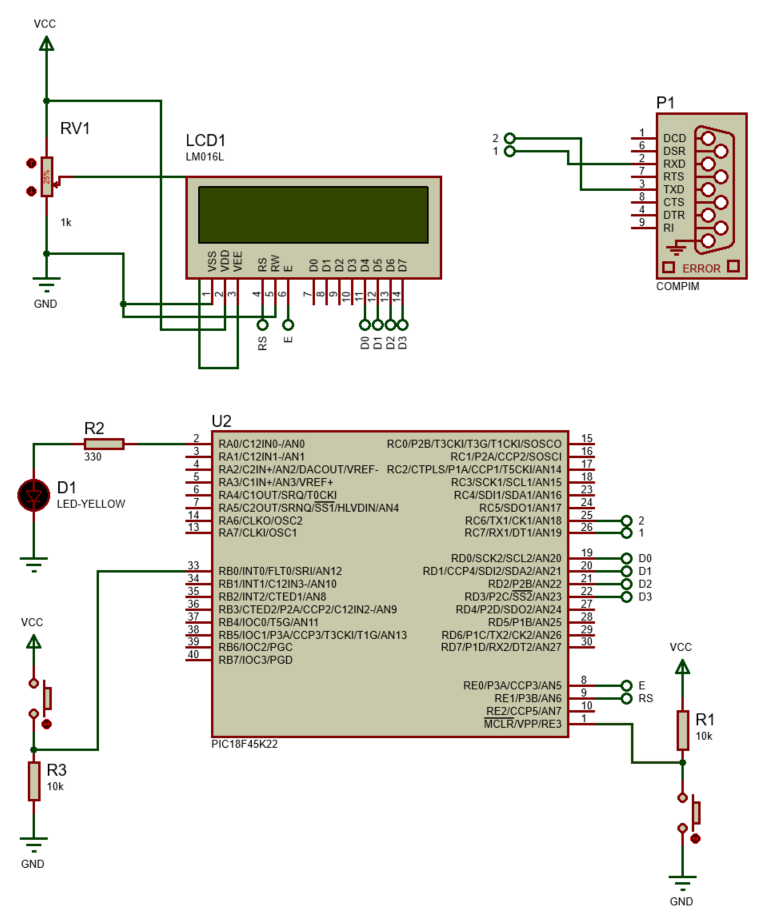

<h1>Aula 5</h1>

Esta clase consiste en utilizar la máquina virtual UR Sim (UR Academy) y en simular la comunicación UART entre Matlab y PIC (Proteus)

<h2>Máquina virtual UR Sim (UR Academy)</h2>

<h3>Curso gratuito UR Sim</h3>

https://academy.universal-robots.com/es/formacion-en-linea-gratuita/formacion-en-linea-de-cb3/

<h3>Sistema operativo de UR Sim</h3>

https://www.universal-robots.com/download/software-cb-series/simulator-non-linux/offline-simulator-cb-series-non-linux-ursim-3158/

<h3>Máquina virtual</h3>

https://www.vmware.com/products/workstation-player/workstation-player-evaluation.html

<h3>Ejercicio 1</h3>


<h2>comunicación UART entre Matlab y PIC (Proteus)</h2>

La comunicación serial entre Matlab y el PIC en Proteus se realiza a través del <i>software</i> `Virtual Serial Port Driver`, el cual se encarga de crear puertos seriales virtuales para la comunicación entre los dos programas.



<h3>Código del PIC 18F45K22</h3>

```c
/*
 * File:   main.c
 * Author: LENOVO
 *
 * Created on 21 de Setembro de 2021, 15:12
 */

#include <xc.h>
#include <pic18f45k22.h>

#pragma config FOSC = INTIO67
#pragma config WDTEN = OFF
#pragma config LVP = OFF

#define _XTAL_FREQ 16000000
#define time 10
//LCD
#define CD 0x01 //Clear Display
#define RH 0x02 //(0x03) Return Home
#define EMS 0x06 //Entry Mode Set
#define DC 0x0F //(0x0E) Display Control
#define DSr 0x1C //Display Shift Rigth
#define DSl 0x18 //Display Shift Left
#define FS 0x28 //(0x3C) Function Set
#define RAW1 0x82 //DDRAM display
#define RAW2 0xC4 //DDRAM display
#define RS LATE1 //Register Selection
#define E LATE0 //Enable

void settings(void);
void __interrupt() RECEIVE(void);
//LCD
void SettingsLCD(unsigned char word);
void WriteLCD(unsigned char word);
void LCD(unsigned char data);

unsigned char d,c,i=0,j=0;

void main(void) {
    settings();
    while(1){
        
    }
}

void SettingsLCD(unsigned char word){
    RS = 0;
    LCD(word >> 4); // 4 MSB
    LCD(word & 0x0F); // 4 LSB
}

void WriteLCD(unsigned char word){
    RS = 1;
    LCD(word >> 4);
    LCD(word & 0x0F);
}

void LCD(unsigned char data){ //Opción bits
    E = 1;
    __delay_us(time*5);
    LATDbits.LATD0 = (data & 0x01);
    __delay_us(time*5);
    LATDbits.LATD1 = (data & 0x02) >> 1;
    __delay_us(time*5);
    LATDbits.LATD2 = (data & 0x04) >> 2;
    __delay_us(time*5);
    LATDbits.LATD3 = (data & 0x08) >> 3;
    __delay_us(time*5);
    E = 0;
    __delay_us(time*5);
}

void settings(void){
    OSCCON = 0x72;
    ANSELA = 0x00;
    ANSELB = 0x00;
    ANSELC = 0x00;
    ANSELD = 0x00;
    ANSELE = 0x00;
    TRISA = 0;
    TRISB = 0xFF;
    TRISD = 0;
    TRISE = 0;
    LATA = 0;
    LATD = 0;
    LATE = 0;
    //LCD
    SettingsLCD(0x02); //Iniciar la LCD con el método nibble (4 MSB y 4 LSB)
    SettingsLCD(EMS);
    SettingsLCD(DC);
    SettingsLCD(FS);
    SettingsLCD(CD);        
    //Serial UART
    TRISCbits.TRISC6 = 0;
    TRISCbits.TRISC7 = 1;
    SPBRG = 0x19;
    RCSTA = 0x90;
    TXSTA = 0x20;
    //Interrupción
    GIE = 1;
    PEIE = 1;
    RCIE = 1;
    RCIF = 0;
    INT0IE = 1;
    INT0IF = 0;
    INTEDG0 = 1;
}

void __interrupt() RECEIVE(void){
    if(RCIF == 1){
        d = RCREG;
        SettingsLCD(RAW1+i);
        WriteLCD(d);
        if(d == 'O'){
            LATAbits.LATA0 = 1;
        }else if(d == 'F'){
            LATAbits.LATA0 = 0;
        }
        i++;
    }if(INT0IF == 1){
        SettingsLCD(RAW2+j);
        c = 'A';
        while(TX1IF == 0);
        TXREG1 = c;
        WriteLCD(c);
        j++;
        INT0IF = 0;
    }    
}
```

<h3>Código de matlab</h3>

```matlab
close all;
clear all;
clc;

oldobj = instrfind;     %elimina resquicios presentes na porta serial
if not(isempty(oldobj)) 
    fclose(oldobj);     
    delete(oldobj);
end

if ~exist('s','var')
    s = serial('COM2','BaudRate',9600,'DataBits',8,'Parity','None','StopBits',1);
end
if strcmp(get(s,'status'),'closed')
    fopen(s);
end

tic
% Apaga os dados iniciais
t_ini = toc; t = 0; 
while (t < 10)
    fprintf(s,'%s','O');
    pause(1);
    fprintf(s,'%s','F');
    pause(1);
    t = toc - t_ini;
end


while (1)
    r = fscanf(s);
    disp('ciclo');
    if(r == 'A')
       disp('break');
       break; 
    end
end

disp('chao');

% Fecha a comunicacao serial
fclose(s);
```
