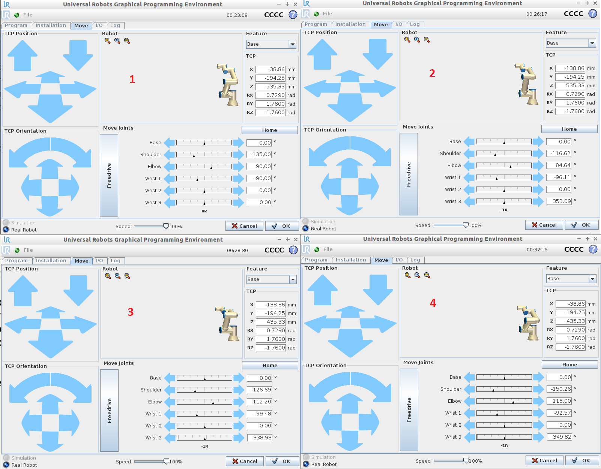

<h1>Aula 5</h1>

Esta clase consiste en utilizar la máquina virtual UR Sim (UR Academy) y en simular la comunicación UART entre Matlab y PIC (Proteus)

<h2>Máquina virtual UR Sim (UR Academy)</h2>


Curso gratuito UR Sim

https://academy.universal-robots.com/es/formacion-en-linea-gratuita/formacion-en-linea-de-cb3/

Sistema operativo de UR Sim

https://www.universal-robots.com/download/software-cb-series/simulator-non-linux/offline-simulator-cb-series-non-linux-ursim-3101/

Máquina virtual

https://www.vmware.com/products/workstation-player/workstation-player-evaluation.html

<h3>Ejercicio 1</h3>



<h2>comunicación UART entre Matlab y PIC (Proteus)</h2>

La comunicación serial entre Matlab y el PIC en Proteus se realiza a través del <i>software</i> `Virtual Serial Port Driver`


```matlab
close all;
clear all;
clc;

oldobj = instrfind;     %elimina resquicios presentes na porta serial
if not(isempty(oldobj)) 
    fclose(oldobj);     
    delete(oldobj);
end

if ~exist('s','var')
    s = serial('COM2','BaudRate',9600,'DataBits',8,'Parity','None','StopBits',1);
end
if strcmp(get(s,'status'),'closed')
    fopen(s);
end

tic
% Apaga os dados iniciais
t_ini = toc; t = 0; 
while (t < 10)
    fprintf(s,'%s','O');
    pause(1);
    fprintf(s,'%s','F');
    pause(1);
    t = toc - t_ini;
end


while (1)
    r = fscanf(s);
    disp('ciclo');
    if(r == 'A')
       disp('break');
       break; 
    end
end

disp('chao');

% Fecha a comunicacao serial
fclose(s);
```
